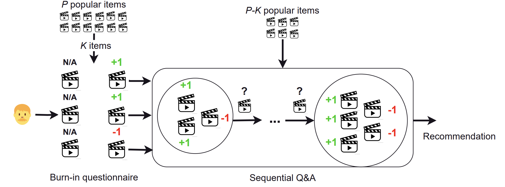

# Official implementation of "Cold-start Recommendation by Personalized Embedding Region Elicitation" (UAI'24)

<a href="https://arxiv.org/pdf/2406.00973"></a>
<div align="center">
  <a href="https://hieunt91.github.io/" target="_blank">Hieu&nbsp;Trung&nbsp;Nguyen</a> &emsp;
  <a href="https://duykhuongnguyen.github.io/" target="_blank">Duy&nbsp;Nguyen</a> &emsp;
  <a href="https://vinuni.edu.vn/people/khoa-d-doan-phd/" target="_blank">Khoa&nbsp;Doan</a> &emsp;
  <a href="https://www.vietanhnguyen.net/" target="_blank">Viet&nbsp;Anh&nbsp;Nguyen</a> &emsp;
  <br> <br>
</div>
<br>

<div align="center">
    
</div>

Details of algorithms and experimental results can be found in [our paper](https://arxiv.org/pdf/2406.00973):
```bibtex
@inproceedings{nguyen2024coldstart,
title={Cold-start Recommendation by Personalized Embedding Region Elicitation},
author={Hieu Trung Nguyen and Duy Nguyen and Khoa D Doan and Viet Anh Nguyen},
booktitle={The 40th Conference on Uncertainty in Artificial Intelligence},
year={2024},
}
```
Please consider citing this paper if it is helpful for you.


## Contact

If you have any problems, please open an issue in this repository or send an email to [hilljun.2000@gmail.com](mailto:hilljun.2000@gmail.com).
